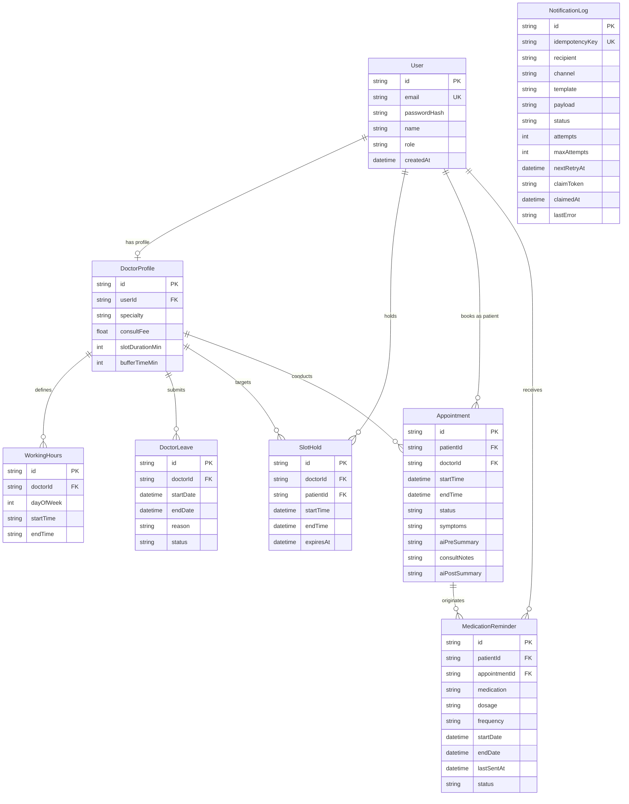

# Database Schema & Storage Strategy

CarePulse utilizes Prisma ORM for relational data modeling with a dual database deployment strategy: **SQLite** for zero-configuration local development and **PostgreSQL** for production environments.

---

## 1. Domain Data Models



---

## 2. Model Specifications

### `User`
- **`id`**: String (UUID, Primary Key)
- **`email`**: String (Unique Index)
- **`passwordHash`**: String (PBKDF2 salted hash)
- **`name`**: String
- **`role`**: Enum (`ADMIN`, `DOCTOR`, `PATIENT`)

### `DoctorProfile`
- **`id`**: String (UUID, Primary Key)
- **`userId`**: String (Foreign Key -> `User.id`, Unique)
- **`specialty`**: String
- **`consultFee`**: Float
- **`slotDurationMin`**: Int (default 30)
- **`bufferTimeMin`**: Int (default 10)

### `SlotHold`
- **`id`**: String (UUID, Primary Key)
- **`doctorId`**: String (Foreign Key -> `DoctorProfile.id`)
- **`patientId`**: String (Foreign Key -> `User.id`)
- **`startTime`**: DateTime
- **`endTime`**: DateTime
- **`expiresAt`**: DateTime (Index for automated cleanup)

### `Appointment`
- **`id`**: String (UUID, Primary Key)
- **`patientId`**: String (Foreign Key -> `User.id`)
- **`doctorId`**: String (Foreign Key -> `DoctorProfile.id`)
- **`startTime`**: DateTime (Compound Index `[doctorId, startTime, endTime]`)
- **`endTime`**: DateTime
- **`status`**: Enum (`HELD`, `CONFIRMED`, `CANCELLED`, `COMPLETED`)
- **`symptoms`**: String (Text)
- **`aiPreSummary`**: String (JSON stringified)
- **`consultNotes`**: String (Text)
- **`aiPostSummary`**: String (JSON stringified)

### `NotificationLog` (Outbox Queue)
- **`id`**: String (UUID, Primary Key)
- **`idempotencyKey`**: String (Unique Index `@unique`)
- **`recipient`**: String
- **`channel`**: Enum (`EMAIL`, `SMS`, `CALENDAR`)
- **`template`**: String
- **`payload`**: String (JSON)
- **`status`**: Enum (`QUEUED`, `PROCESSING`, `SENT`, `FAILED`, `DLQ`)
- **`attempts`**: Int (default 0)
- **`maxAttempts`**: Int (default 5)
- **`nextRetryAt`**: DateTime (Index for worker polling)
- **`claimToken`**: String (Nullable, for atomic worker lease claiming)
- **`claimedAt`**: DateTime (Nullable, for 5-min stale worker lease recovery)
- **`lastError`**: String (Nullable)

---

## 3. Database Engine Deployment Strategy

### Local Development (SQLite)
- Local development uses SQLite (`prisma/dev.db`).
- Double-booking prevention is enforced via two-phase reservation (`SlotHold` + Prisma `$transaction` interactive locks).

### Production Deployment (PostgreSQL)
- Production deployments use PostgreSQL.
- In addition to application-level `$transaction` checks, concurrency is additionally enforced at the database engine level via a GiST exclusion constraint on overlapping appointment time ranges for the same doctor.
- Migration file provided at `prisma/migrations/20260821000000_postgresql_gist_exclusion/migration.sql`:
  ```sql
  CREATE EXTENSION IF NOT EXISTS btree_gist;

  ALTER TABLE "Appointment"
  ADD CONSTRAINT "no_overlapping_appointments"
  EXCLUDE USING gist (
    "doctorId" WITH =,
    tsrange("startTime", "endTime") WITH &&
  )
  WHERE (status IN ('CONFIRMED', 'HELD'));
  ```
