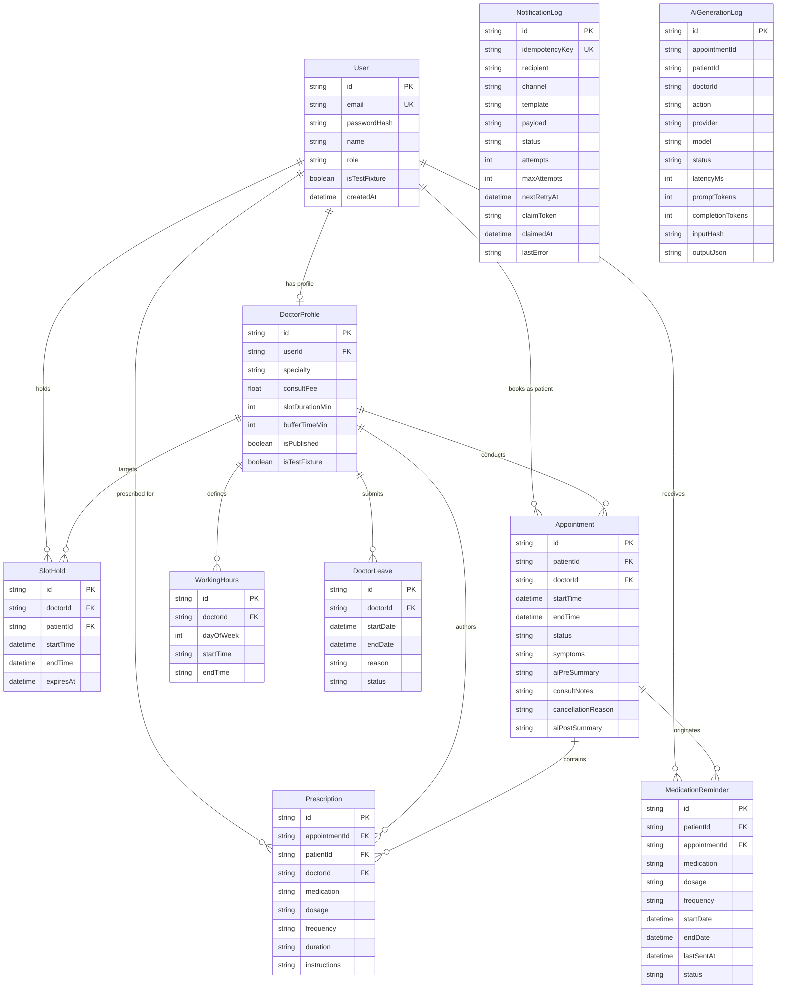

# Database Schema & Storage Strategy

CarePulse utilizes Prisma ORM for relational data modeling with a dual database deployment strategy: **SQLite** for zero-configuration local development and **PostgreSQL** for production environments.

---

## 1. Domain Data Models



---

## 2. Model Specifications

### `User`
- **`id`**: String (UUID, Primary Key)
- **`email`**: String (Unique Index)
- **`passwordHash`**: String (PBKDF2 salted hash)
- **`name`**: String
- **`role`**: Enum (`ADMIN`, `DOCTOR`, `PATIENT`)
- **`isTestFixture`**: Boolean (default `false`)

### `DoctorProfile`
- **`id`**: String (UUID, Primary Key)
- **`userId`**: String (Foreign Key -> `User.id`, Unique)
- **`specialty`**: String
- **`consultFee`**: Float (`DOUBLE PRECISION` in PostgreSQL)
- **`slotDurationMin`**: Int (default 30)
- **`bufferTimeMin`**: Int (default 10)
- **`isPublished`**: Boolean (default `true`)
- **`isTestFixture`**: Boolean (default `false`)

### `SlotHold`
- **`id`**: String (UUID, Primary Key)
- **`doctorId`**: String (Foreign Key -> `DoctorProfile.id`)
- **`patientId`**: String (Foreign Key -> `User.id`)
- **`startTime`**: DateTime (`TIMESTAMP(3)` in PostgreSQL)
- **`endTime`**: DateTime (`TIMESTAMP(3)` in PostgreSQL)
- **`expiresAt`**: DateTime (Index for automated cleanup)

### `Appointment`
- **`id`**: String (UUID, Primary Key)
- **`patientId`**: String (Foreign Key -> `User.id`)
- **`doctorId`**: String (Foreign Key -> `DoctorProfile.id`)
- **`startTime`**: DateTime (Compound Index `[doctorId, startTime, endTime]`)
- **`endTime`**: DateTime
- **`status`**: Enum (`HELD`, `CONFIRMED`, `CANCELLED`, `COMPLETED`)
- **`symptoms`**: String (Text)
- **`aiPreSummary`**: String (JSON stringified)
- **`consultNotes`**: String (Text)
- **`cancellationReason`**: String (Text, Nullable)
- **`aiPostSummary`**: String (JSON stringified)

### `Prescription`
- **`id`**: String (UUID, Primary Key)
- **`appointmentId`**: String (Foreign Key -> `Appointment.id`)
- **`patientId`**: String (Foreign Key -> `User.id`)
- **`doctorId`**: String (Foreign Key -> `DoctorProfile.id`)
- **`medication`**: String
- **`dosage`**: String
- **`frequency`**: String
- **`duration`**: String
- **`instructions`**: String (Nullable)
- **Unique Constraint**: `@@unique([appointmentId, medication, dosage, frequency, duration])`

### `NotificationLog` (Outbox Queue)
- **`id`**: String (UUID, Primary Key)
- **`idempotencyKey`**: String (Unique Index `@unique`)
- **`recipient`**: String
- **`channel`**: Enum (`EMAIL`, `SMS`, `CALENDAR`)
- **`template`**: String
- **`payload`**: String (JSON)
- **`status`**: Enum (`QUEUED`, `PROCESSING`, `SENT`, `FAILED`, `DLQ`)
- **`attempts`**: Int (default 0)
- **`maxAttempts`**: Int (default 5)
- **`nextRetryAt`**: DateTime (Index for worker polling)
- **`claimToken`**: String (Nullable, for atomic worker lease claiming)
- **`claimedAt`**: DateTime (Nullable, for 5-min stale worker lease recovery)
- **`lastError`**: String (Nullable)

### `AiGenerationLog` (Audit Log)
- **`id`**: String (UUID, Primary Key)
- **`appointmentId`**: String (Nullable)
- **`patientId`**: String (Nullable)
- **`doctorId`**: String (Nullable)
- **`action`**: String (`PRE_VISIT` or `POST_VISIT`)
- **`provider`**: String (`openai`, `mock`, `test`)
- **`model`**: String (`gpt-4o-mini`)
- **`promptVersion`**: String (default `1.0`)
- **`status`**: String (`SUCCESS`, `FAILED`, `TIMEOUT`)
- **`requestId`**: String (Nullable, OpenAI request ID)
- **`latencyMs`**: Int
- **`promptTokens`**: Int
- **`completionTokens`**: Int
- **`inputHash`**: String (SHA-256 slice)
- **`outputJson`**: String (JSON)

---

## 3. PostgreSQL Production Migration Sequence

Production deployments execute version-controlled Prisma migrations in chronological sequence via `npx prisma migrate deploy`:

1. **`20260820000000_init_postgresql_schema`**: Base table creation using native PostgreSQL data types (`TIMESTAMP(3)`, `DOUBLE PRECISION`, `BOOLEAN`, `TEXT`).
2. **`20260821000000_postgresql_gist_exclusion`**: Enables `btree_gist` extension and adds PostgreSQL GiST exclusion constraint (`no_overlapping_appointments`) to the `Appointment` table:
   ```sql
   CREATE EXTENSION IF NOT EXISTS btree_gist;

   ALTER TABLE "Appointment"
   ADD CONSTRAINT "no_overlapping_appointments"
   EXCLUDE USING gist (
     "doctorId" WITH =,
     tsrange("startTime", "endTime") WITH &&
   )
   WHERE (status IN ('CONFIRMED', 'HELD'));
   ```
3. **`20260823000000_ai_generation_log_and_test_fixtures`**: Creates `AiGenerationLog` audit log table and indexes.
